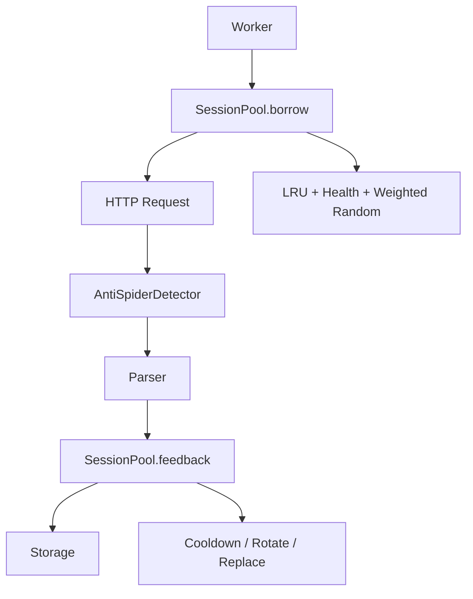

# 搜狗微信搜索爬虫系统

一个面向生产环境设计的 Python 爬虫，专注于搜狗微信搜索结果的稳定采集。

<p align="center">


</p>

---

## 项目价值

在实际业务场景中，搜狗微信搜索数据常被用于：

- 舆情监控与热点事件追踪
- 行业研究与竞品动态分析
- 内容选题参考与公众号生态研究
- 知识库内容补充与来源追溯

区别于简单的抓取脚本，本项目围绕**稳定性、扩展性、抗反爬能力**设计，可直接用于生产环境。

---

## 项目构建过程开源

本项目基于 Vibe Coding 方法论构建，不仅开源代码，还公开完整的构建过程，便于学习交流：

`vibe_coding/` 目录包含：

- `ChatGPT plan 记录.pdf`：需求规划阶段与 ChatGPT 的对话记录
- `agent_code.md`：用于代码生成的完整提示词
- `Codex 对话记录.pdf`：代码生成过程中与 Codex 的交互记录

---

## 功能边界说明

- 目前仅支持抓取**微信公众号文章搜索结果**（`type=2` 文章维度）
- 暂未实现公众号主页、文章正文、阅读量 / 评论数等信息的采集

---

## 核心特性

### 生产级会话池管理

- 完整的 Session 生命周期管控（创建 → 可用 → 借出 → 冷却 → 销毁）
- 基于健康分的调度策略，优先使用状态良好的会话
- 自动冷却恢复机制，降低账号 / IP 封禁风险

### 智能会话调度

- 结合 LRU（最近最少使用）策略优先调度
- 健康度加权随机分配，平衡会话使用率
- 单 Session 请求频率控制，避免单一会话请求过于密集

### 反爬适配能力

- 自动检测验证码、302 反爬页面、403/429 状态码、异常 HTML 内容
- 失败类型精细化分类：`NETWORK_ERROR / SERVER_ERROR / PARSE_ERROR / ANTISPIDER / RATE_LIMIT / SUCCESS`
- 遇到反爬优先冷却会话，而非直接销毁，降低资源浪费

### 专属代理绑定

- 单个 Session 绑定单个代理 IP
- 避免 IP/UA/Cookie 信息漂移，减少被风控识别的概率

### 动态代理配置

- 通过 YAML 文件管理代理池
- 支持配置文件热更新（可手动关闭），无需重启程序即可更新代理

### 标准化输出

提取结构化字段，便于下游系统直接使用：

- `title`：文章标题
- `account_name`：公众号名称
- `publish_time`：发布时间
- `article_desc`：文章摘要
- `image_url`：封面图片链接
- `sogou_url`：搜狗跳转链接

---

## 对比优势

|能力维度|本项目特点|
|---|---|
|架构设计|模块化生产级架构（调度器 / 会话池 / 检测器 / 解析器 / 存储），而非一次性脚本|
|抗反爬策略|反爬检测 + 失败分类 + 会话冷却，避免无效硬重试导致的封禁升级|
|会话调度|LRU + 健康分 + 加权随机，兼顾稳定性与采集效率|
|代理使用|会话与代理一对一绑定，降低行为特征漂移风险|
|运维便捷性|代理池支持 YAML 配置和热更新，扩容代理无需修改代码|
|资源控制|全局限速 + 会话级请求间隔，平衡采集速度与账号存活率|
|长期运行稳定性|会话最大请求数轮换、失败阈值替换、后台冷却恢复，支持 7×24 小时运行|
|集成友好性|输出结构化数据，可直接对接知识库、数据平台、监控系统|
|开源透明度|公开完整的项目构建过程，便于学习和二次开发|

---

## 项目架构



---

## 代码结构

```
crawler_project/
  main.py               # 主程序入口
  requirements.txt      # 依赖清单

  session_pool/         # 会话池模块
    session_client.py
    session_pool.py
    session_factory.py

  proxy_pool/           # 代理池模块
    proxy_pool.py

  scheduler/            # 调度器模块
    request_scheduler.py

  detector/             # 反爬检测模块
    antispider_detector.py

  crawler/              # 爬虫核心模块
    worker.py
    sogou_spider.py

  parser/               # 数据解析模块
    sogou_parser.py

  utils/                # 工具函数
    headers_profiles.py
    rate_limiter.py
```

---

## 快速开始

### 1. 安装依赖

```
pip install -r crawler_project/requirements.txt
```

### 2. 基础使用

```
cd crawler_project
python main.py --keyword AI --pages 3
```

### 3. 进阶使用示例

```
python main.py --keyword AI --pages 5 --workers 3 --session-pool-size 8 --rate-limit 2 --max-retries 2
```

---

## 代理池配置（YAML）

可通过 YAML 文件配置代理池，支持动态更新。

### 1. 配置文件格式

```
proxy_pool:
  auto_reload: true        # 是否自动重载配置
  reload_interval: 15      # 重载间隔（秒）
  proxies:
    - http://127.0.0.1:8080
    - http://127.0.0.1:8081
```

### 2. 指定配置文件（PowerShell）

```
$env:PROXY_POOL_YAML = "E:\path\to\proxy_pool.yaml"
python main.py --keyword AI --pages 3
```

### 3. 默认配置文件查找顺序

若未设置环境变量，程序会依次查找以下路径：

- `./proxy_pool.yaml`
- `./proxy_pool.yml`
- `./crawler_project/proxy_pool/proxy_pool.yaml`
- `./crawler_project/proxy_pool/proxy_pool.yml`

---

## 输出示例

```
[
  {
    "title": "荣耀三连冠: AI 技术推力解析",
    "account_name": "华尔街见闻",
    "publish_time": "2024-04-26 14:17:08",
    "article_desc": "荣耀布局AI技术...",
    "image_url": "https://img01.sogoucdn.com/...",
    "sogou_url": "https://weixin.sogou.com/link?..."
  }
]
```

---

## 代理扩容参数调整建议

增加代理数量后，建议按以下优先级调整参数：

1. `session_pool_size`（会话池容量）
2. `worker_count`（工作线程数）
3. `global_rate_limit`（全局限速）
4. `request_interval`（会话级请求间隔）
5. `max_retries`（最大重试次数）与 `request_timeout`（请求超时时间）

调整原则：**先扩大会话池容量，再提升全局速率，最后缩短单会话请求间隔**。

---

## 免责声明

- 本项目仅用于学习、研究和合规场景的数据采集
- 使用时请遵守目标网站的服务条款、robots 协议及相关法律法规

---

<p align="center">

<strong>如果本项目对你的工作有帮助，欢迎点个 Star ⭐</strong>

</p>